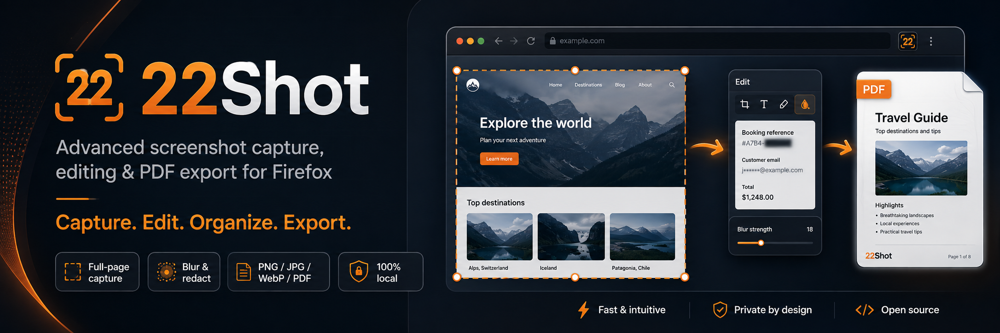
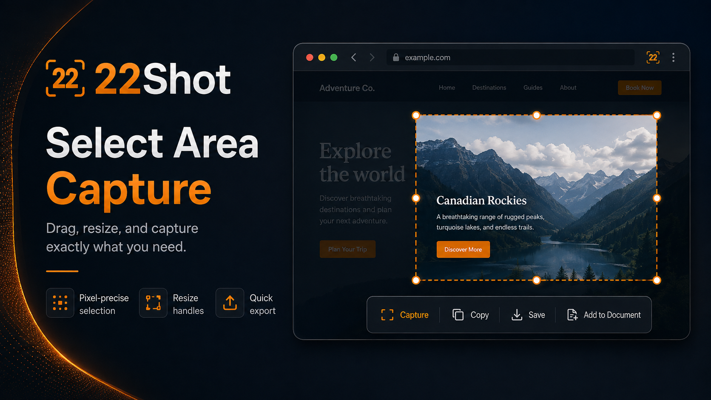
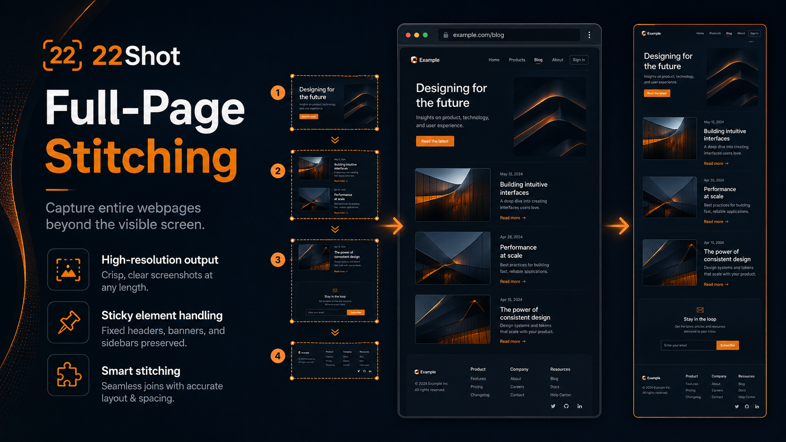
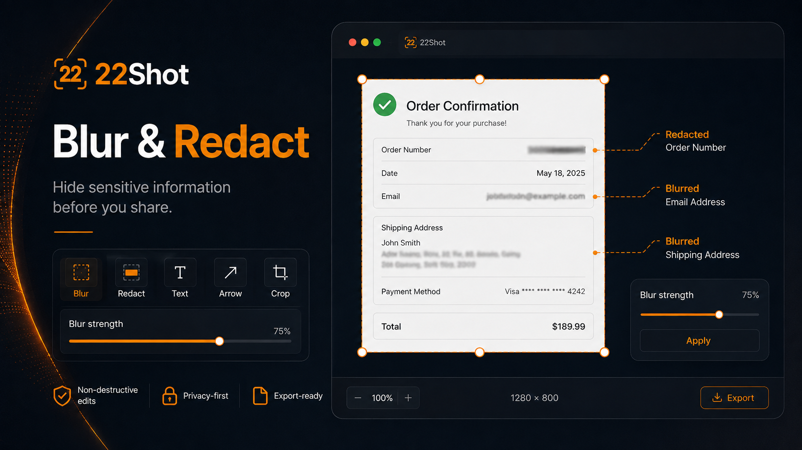
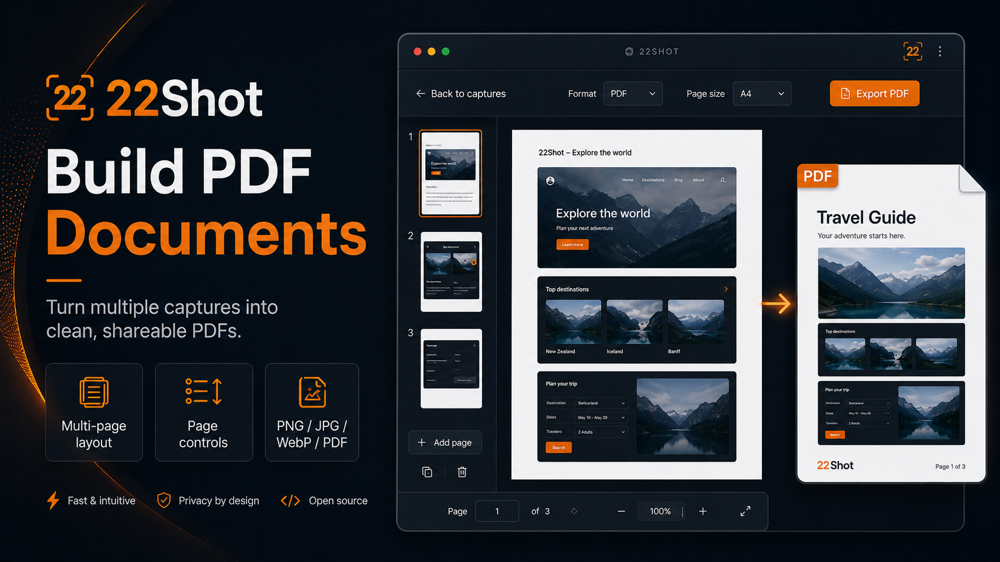

<div align="center">



<br>

# 22Shot

### Advanced screenshot capture, editing & PDF export for Firefox

**Capture any part of a webpage. Edit it. Build documents. Export it — entirely on your device.**

[](https://www.mozilla.org/firefox/)
[](#architecture)
[](#development)
[](#privacy)
[](LICENSE)
[](https://github.com/NightForceX/22Shot/stargazers)
[](https://github.com/NightForceX/22Shot/issues)

</div>

---

## Capture more than what fits on your screen

**22Shot** is a privacy-first **Firefox screenshot extension** for capturing selected areas, visible content, webpage elements, full webpages, and internally scrollable content.

After capture, use the built-in workspace to **blur or redact sensitive information, annotate screenshots, organize multiple captures into documents, and export to PNG, JPEG, WebP, or PDF**.

Unlike cloud-based screenshot services, **22Shot processes captures locally**. There are no accounts, screenshot uploads, telemetry, ads, remote scripts, or external APIs.

> 🔒 **Private by design:** your screenshots stay on your device.

---

## ✨ Highlights

| Feature | What 22Shot does |
|---|---|
| 🎯 **Selected-area capture** | Drag, move, and resize a precise screenshot region |
| 🖥️ **Visible-area capture** | Capture exactly what Firefox currently renders |
| 🧩 **Smart element capture** | Hover and select webpage elements directly |
| 📜 **Full-page screenshot** | Scroll, capture, crop, and stitch long webpages |
| 🪟 **Scrollable elements** | Capture content inside internally scrolling panels |
| 🧱 **Iframe support** | Best-effort iframe capture with optional host access |
| 📌 **Sticky/fixed handling** | Auto / Keep / Hide modes help stop duplicated headers |
| 🖌️ **Screenshot editor** | Blur, redact, arrows, lines, shapes, text, highlight, and freehand drawing |
| 📚 **Document workspace** | Combine multiple screenshots into organized documents |
| 📄 **PDF export** | Build screenshot PDFs with page layout and page-break controls |
| 🖼️ **Image export** | Export as PNG, JPEG, or WebP |
| 📋 **Clipboard copy** | Copy captures directly to the clipboard |
| 🔐 **100% local processing** | No screenshot upload, account, telemetry, or external API |

---

## 🎯 Select exactly what you need



Use **Select Area** when you only need part of a webpage.

22Shot places a capture overlay over the current page so you can drag a region, reposition it, resize it with handles, and then capture exactly that area.

The result can be:

- copied to the clipboard;
- saved as an image;
- opened in the editor; or
- added directly to a screenshot document.

---

## 📜 Full-page screenshots



Capture webpages that extend far beyond the visible browser window.

22Shot's full-page workflow uses:

**scroll → capture → crop → stitch**

The extension captures page segments at native browser resolution and combines them into a single long screenshot.

### Fixed and sticky elements

Long-page screenshots often break when the same navigation bar, cookie notice, sidebar, or floating widget appears in every captured segment.

22Shot includes three handling modes:

- **Auto** — automatically manage likely fixed/sticky elements;
- **Keep** — preserve them as rendered; and
- **Hide** — temporarily hide them during the stitched capture.

Original page state is restored when capture finishes or is cancelled.

---

## 🔒 Blur & redact sensitive information



Screenshots often contain information that should not be shared.

The 22Shot editor includes tools for:

- **Blur**
- **Redact**
- **Arrow**
- **Line**
- **Shapes**
- **Text**
- **Highlight**
- **Freehand drawing**

The editor keeps the original bitmap and stores edits as operations. The final image is rasterized when exported.

That makes it possible to edit a capture without repeatedly degrading the source image.

---

## 📄 Build screenshot documents and PDFs



22Shot goes beyond one-off screenshots.

Capture content from different pages or tabs, add each capture to a document, arrange the pages, and export everything as one PDF.

Useful for:

- 🐛 bug reports;
- 🧰 troubleshooting records;
- 📚 technical documentation;
- 🔎 research notes;
- 🛒 product comparisons;
- 🧾 receipts and order records;
- 🗂️ webpage archiving; and
- 📊 visual reports.

### Screenshot PDF vs webpage PDF

22Shot keeps these as separate workflows:

**Screenshot-document PDF**  
Your captures are placed into a PDF document that you control.

**Save Webpage as PDF**  
Uses Firefox's native webpage-to-PDF capability, preserving webpage-style PDF output and real hyperlinks where Firefox supports it.

> **Note:** Firefox's native `tabs.saveAsPDF()` API is not available on macOS.

---

## 📸 Capture modes

### 1. Visible area

Capture exactly what is currently visible in the active Firefox tab using Firefox's native tab-capture API.

### 2. Select area

Use a dimmed overlay to drag, resize, and move a capture region before taking the screenshot.

### 3. Select element

Hover over webpage content to highlight a DOM element and capture it directly.

Use **Alt + ↑ / ↓** to move through the element hierarchy.

### 4. Full page

Capture a long webpage in multiple viewport-sized segments and stitch them into a single high-resolution image.

### 5. Scrollable element

If the selected element contains its own scrolling region, 22Shot can capture content beyond the portion currently visible.

### 6. Webpage PDF

Use Firefox's native PDF functionality as a separate workflow from screenshot-document PDFs.

---

## 🪟 Scrollable elements and iframes

Modern webpages frequently place content inside nested scrolling panels or embedded frames.

22Shot includes support for:

- vertically scrollable elements;
- internally scrolling page panels;
- same-origin frames; and
- best-effort iframe access when Firefox permissions allow it.

Optional `<all_urls>` access can be granted from the extension options for deeper iframe support.

Because Firefox intentionally protects certain cross-origin and sandboxed frames, some iframe content may remain inaccessible. 22Shot does not attempt to bypass browser security restrictions.

---

## 🖼️ Export formats

| Output | Support |
|---|:---:|
| PNG | ✅ |
| JPEG | ✅ |
| WebP | ✅ |
| Screenshot-document PDF | ✅ |
| Clipboard image copy | ✅ |
| Firefox native webpage PDF | ✅* |

\* Native Firefox webpage PDF is unavailable through `tabs.saveAsPDF()` on macOS.

---

## 🔐 Privacy

22Shot is designed for **local screenshot processing**.

### No cloud required

22Shot does **not** require:

- an account;
- cloud storage;
- screenshot uploads;
- analytics or telemetry;
- advertising SDKs;
- remote JavaScript;
- external APIs; or
- third-party image-processing services.

Captured images and document data stay on your device.

Large screenshot blobs are stored locally using **IndexedDB**. Extension settings are stored with `browser.storage.local`.

The Firefox manifest declares:

```json
"data_collection_permissions": {
  "required": ["none"]
}
```

---

## 🚀 Install from source

### Requirements

- **Desktop Firefox 128+**
- **Node.js 20+** to build from source

Clone the repository:

```bash
git clone https://github.com/NightForceX/22Shot.git
cd 22Shot
```

Install dependencies:

```bash
npm install
```

Build the extension:

```bash
npm run build
```

Then load it into Firefox:

1. Open `about:debugging#/runtime/this-firefox`
2. Click **Load Temporary Add-on…**
3. Select `manifest.json` from the repository root  
   **or** `dist/manifest.json`
4. Open a normal `http://` or `https://` webpage
5. Click the **22Shot** toolbar button

After rebuilding the extension, click **Reload** beside 22Shot in `about:debugging`.

`npm run build` generates the loadable extension next to the root `manifest.json` and also mirrors the build into `dist/`.

---

## 🛠️ Development

### Useful commands

| Command | Description |
|---|---|
| `npm run build` | Generate icons and bundle the extension |
| `npm start` | Build and run with `web-ext` |
| `npm run package` | Create a distributable ZIP under `artifacts/` |
| `npm run typecheck` | Run the TypeScript type check |
| `npm test` | Build + smoke tests + live Firefox UI tests |
| `npm run test:smoke` | Run the fast static/unit smoke suite |
| `npm run test:live` | Run headless Firefox Selenium UI tests |

### Local capture test pages

The repository includes fixtures for long pages, sticky elements, lazy loading, iframes, HiDPI rendering, and other screenshot scenarios.

Start the fixtures with:

```bash
npx --yes serve test-pages -p 4173
```

See [`CHECKLIST.md`](CHECKLIST.md) for the manual QA checklist.

---

## 🧱 Architecture

22Shot is built as a **Firefox Manifest V3 WebExtension**.

```text
src/
├── background/   # messaging, capture orchestration, menus
├── capture/      # visible / region / full-page capture and stitching
├── content/      # overlay, element picker, scroll helpers
├── editor/       # screenshot workspace and editing tools
├── document/     # PDF layout and export
├── popup/        # Firefox toolbar popup
├── options/      # extension settings
├── shared/       # types, messages, filename and security helpers
└── storage/      # IndexedDB and settings
```

### Under the hood

- Firefox MV3 event page using `background.scripts`
- TypeScript
- Typed message protocol in `src/shared/messages.ts`
- Captures stored in IndexedDB
- Settings stored in `browser.storage.local`
- Full-page capture built around `captureVisibleTab` + crop + stitch
- `OffscreenCanvas` used for image processing
- Original bitmap + edit-operation model in the editor
- `pdf-lib` lazy-loaded for PDF features

---

## 🔑 Permissions

22Shot requests only permissions used by its capture and export workflows.

| Permission | Why it is used |
|---|---|
| `activeTab` | Capture or inject into the current tab after a user action |
| `tabs` | Read page titles/URLs for filenames and target the active tab |
| `scripting` | Inject selection overlays, element selectors, and scrolling helpers |
| `downloads` | Save screenshots and PDF files |
| `clipboardWrite` | Copy screenshots to the clipboard |
| `menus` | Add screenshot commands to Firefox context menus |
| `storage` | Store extension settings |
| `unlimitedStorage` | Support large local screenshot/document data |
| Optional `<all_urls>` | Enable deeper iframe access when explicitly granted |

---

## ⚠️ Firefox limitations

Some browser restrictions cannot and should not be bypassed by a WebExtension.

- Firefox's private built-in Screenshot engine cannot be reused directly.
- Cross-origin or sandboxed iframes can remain inaccessible.
- `tabs.saveAsPDF()` is unavailable on macOS.
- Privileged pages such as `about:` pages and some Firefox/AMO pages cannot be captured.
- Extremely large webpages can exceed browser canvas limits.

For very large captures, the extension should use safer split/export handling instead of attempting an unsafe canvas allocation.

---

## 💡 Why 22Shot?

A normal screenshot tool ends when the image is captured.

22Shot is built around the complete web-capture workflow:

<div align="center">

### **Capture → Edit → Organize → Export**

</div>

Take a quick screenshot, capture an entire scrolling page, hide sensitive information, combine multiple captures into a document, and export the result — all without sending the screenshots to a third party.

---

## 🔎 Keywords

Firefox screenshot extension · full-page screenshot · scrolling screenshot · webpage capture · screen capture · screenshot editor · blur screenshot · redact screenshot · screenshot to PDF · webpage to PDF · PNG screenshot · JPEG screenshot · WebP screenshot · Firefox WebExtension · private screenshot tool · local screenshot tool

---

## 📌 Project status

- **Current version:** `1.0.0`
- **Target browser:** Desktop Firefox
- **Minimum Firefox version:** `128`
- **Manifest:** V3

Found a bug or have an idea?  
[Open an issue](https://github.com/NightForceX/22Shot/issues).

---

## 📜 License

22Shot is open-source software released under the **MIT License**.

You are free to use, copy, modify, merge, publish, distribute, sublicense, and
sell copies of the software, subject to the terms of the license.

See [`LICENSE`](LICENSE) for the full license text.

---

<div align="center">

## 22Shot

### **Capture the page. Keep the details.**

**Firefox screenshot capture · Full-page stitching · Blur & redaction · PDF documents**

[View the repository](https://github.com/NightForceX/22Shot) ·
[Report a bug](https://github.com/NightForceX/22Shot/issues) ·
[Star 22Shot](https://github.com/NightForceX/22Shot)

</div>
